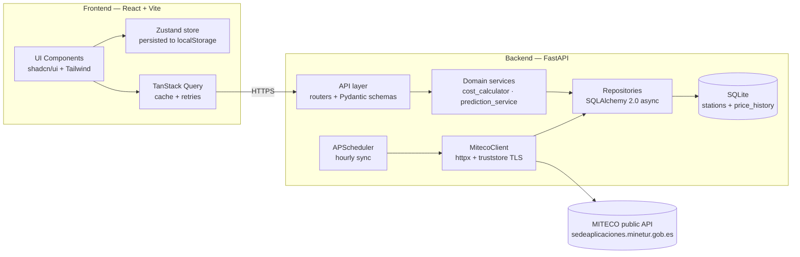
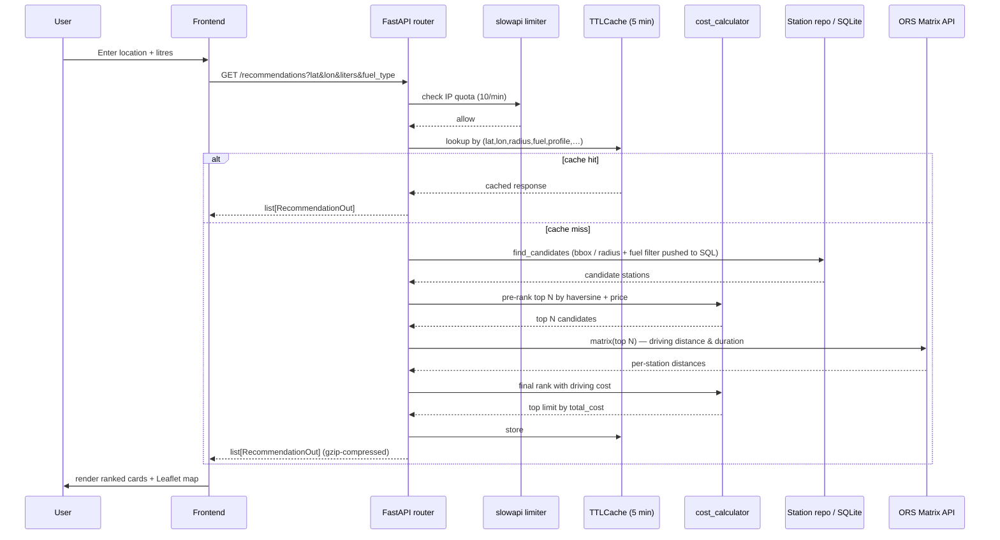

# Data Fuel ⛽

> **Find the cheapest gas station — not by price per liter, but by total refuelling cost.**
> A full-stack app that combines real-time Big Data from the Spanish MITECO API with AI price prediction to answer a simple question: *where should I actually drive to fill up?*

<p align="center">
  
  
  
  
  
  
  
  
  
  
</p>

<!-- IMAGE: hero screenshot — main app view (search form + results) — place a wide screenshot here -->
<p align="center">
  
</p>

---

## Why this project

Most fuel apps sort by price per liter and stop there. But driving 15 km to save 3 cents per liter on a 40 L fill-up is a **loss**. Data Fuel solves the actual optimisation problem:

$$
C_i = (V \cdot P_i) + (D_i \cdot K)
$$

| Variable | Meaning |
|---|---|
| `V`  | Litres to refuel (user input) |
| `Pᵢ` | Fuel price at station *i* (€/L) |
| `Dᵢ` | Distance to station *i* (km, haversine) |
| `K`  | Vehicle cost per km (default 0.13 €/km) |

On top of this, a **scikit-learn Ridge regression** predicts the 48-hour price direction per station and suggests *"wait"* or *"refuel now"* based on the expected delta.

---

## Highlights

- **Clean Architecture backend** — strict dependency direction (`domain → services → repositories → infrastructure → API`). No ORM leaks into domain, no HTTP into business logic.
- **Async end-to-end** — FastAPI + SQLAlchemy 2.0 async + `httpx.AsyncClient`. Sync job runs on APScheduler without blocking the event loop.
- **Typed end-to-end** — `mypy --strict` on the backend, `tsc --strict` + `exactOptionalPropertyTypes` + `noUncheckedIndexedAccess` on the frontend. Zero `any` leaking into public signatures.
- **176 backend + 25 frontend tests, 86% coverage** — unit tests for domain logic, integration tests hitting a real in-memory SQLite via ASGI transport, repo-level tests for SQL behaviour. Frontend tests cover components, hooks, and API clients.
- **Real data source** — the official Spanish MITECO carburantes API (not web scraping), refreshed hourly via APScheduler with idempotent upserts.
- **ML pipeline** — a `Pipeline` with `ColumnTransformer` (numerical scaling + one-hot encoding) + `Ridge` regression, trained on 30 days of price history with 6-hour per-fuel-type caching.
- **Performance pass** — SQL-side bbox/radius prefilter (skips ~10 k row hydration per call), top-N pre-rank by haversine before the ORS Matrix call (~5× cheaper quota), async-safe TTL cache on `/recommendations` (cache hits return in <1 ms), GZip middleware (~70 % smaller JSON), Vite manual chunks + lazy-loaded routes and Recharts.
- **Hardened** — per-endpoint rate limiting (slowapi), CORS allow-list from env, docs endpoints gated behind `DEBUG`, TLS verification via `truststore`, parameterised queries throughout.

---

## Screenshots

<!-- IMAGE: search form — input card with location picker, fuel selector, liters, km cost -->
<table>
  <tr>
    <td align="center"><strong>Search form</strong><br/>
      
    </td>
    <td align="center"><strong>Results + map</strong><br/>
      
    </td>
  </tr>
  <tr>
    <td align="center"><strong>Price history (expanded card)</strong><br/>
      
    </td>
    <td align="center"><strong>Prediction badge</strong><br/>
      
    </td>
  </tr>
</table>

<!-- IMAGE: favorites filter — shows the heart toggle + filter pill -->
<p align="center">
  
</p>

---

## Architecture

Clean Architecture with strict layering. Arrows represent dependencies (the inner layers know nothing about the outer ones).



Request flow for the core endpoint `GET /api/v1/recommendations`:



---

## Tech stack & rationale

| Concern | Choice | Why |
|---|---|---|
| Backend framework | **FastAPI** | Async, native Pydantic v2, auto OpenAPI, typed by default |
| ORM | **SQLAlchemy 2.0 async** | Typed API, async driver, upsert helpers, mature migration story (Alembic) |
| DB | **SQLite (aiosqlite)** | Single-file, zero ops, enough write throughput for hourly MITECO sync. Trivially swappable to Postgres via `DATABASE_URL` |
| Scheduling | **APScheduler** | Lightweight, no Redis/Celery dependency for a job that runs hourly |
| ML | **scikit-learn** (`Pipeline` + `Ridge`) | Deterministic, explainable, fast to retrain, no GPU. Trained lazily and cached 6 h per fuel type |
| HTTP client | **httpx + truststore** | Async, uses OS trust store (Windows-friendly, no bundled CAs drift) |
| Rate limiting | **slowapi** | FastAPI-native, IP-keyed, in-memory for dev, pluggable storage for prod |
| Compression | **GZipMiddleware** (`minimum_size=1024`) | ~70 % smaller JSON for ranked-stations and prediction payloads |
| Server cache | **In-process TTLCache** (`asyncio.Lock`, 5 min) | Hot `/recommendations` traffic short-circuits the DB + ORS pipeline; invalidated after every MITECO sync |
| Frontend | **React 18 + Vite + TypeScript** | Fast HMR, strict TS config, modern JSX transform |
| Styling | **Tailwind + shadcn/ui** | Utility-first with accessible Radix primitives |
| Data fetching | **TanStack Query** | Cache, dedupe, `enabled` flag for lazy charts, retries, stale-while-revalidate |
| State | **Zustand** (persisted) | Small footprint, selector-based subscriptions, `persist` middleware for favourites/settings |
| Maps | **Leaflet + react-leaflet** | OSM tiles, no API key, lightweight |
| Charts | **Recharts** | SVG, responsive, first-class React API |

---

## Features

### Core
- **Cost ranking** — haversine distance + the cost formula above, with configurable `K`, max distance, and result limit.
- **Optional driving distance** — when `DISTANCE_MODE=DRIVING`, the top-N candidates (by haversine cost) go through the OpenRouteService Matrix API for real road distance and duration; otherwise haversine alone is used.
- **Real-time data** — hourly upsert from MITECO keeps station metadata and current prices fresh; every sync also appends a row to `price_history` for ML training and charting.
- **Interactive map** — Leaflet markers for every ranked station, centred on the user.
- **Price history** — per-station chart whose component (~300 KB Recharts) and data are *both* deferred until the user expands a card.

### AI / ML
- **Training features** — hour-of-day, day-of-week, brand, province.
- **Model** — `ColumnTransformer` (StandardScaler + OneHotEncoder) → `Ridge(alpha=1.0)`.
- **Caching** — one trained pipeline per `FuelType`, TTL 6 h.
- **Output** — predicted price at +48 h, percentage change, Spanish-language advice (`"Espera, el precio bajará…"` / `"Reposta ahora…"`), and the model's R² so users can see confidence.

### UX
- **Favourites** — heart toggle per station, persisted in `localStorage` via Zustand's `persist` middleware, plus a pill to filter results by favourites only.
- **Skeleton loaders** — mirrored-layout skeletons during fetch, no jumpy spinner.
- **Location picker** — geolocation API with graceful fallback to manual coords.
- **Health badge** — live backend status indicator in the header.

---

## API reference

Base URL (dev): `http://localhost:8000/api/v1`

| Method | Path | Description |
|---|---|---|
| `GET` | `/health` | Liveness + version |
| `GET` | `/stations` | List stations, filter by `province` / `municipality` |
| `GET` | `/stations/{id}` | Single station |
| `GET` | `/stations/{id}/price-history/{fuel_type}?days=30` | Price history for charting |
| `GET` | `/recommendations?lat&lon&liters&fuel_type&...` | Ranked stations by total cost |
| `GET` | `/predictions/{station_id}/{fuel_type}` | 48-hour price prediction + advice |

Full OpenAPI is available at `/docs` (Swagger UI) and `/redoc` when `DEBUG=true`.

---

## Project structure

```
datafuel-main/
├── backend/
│   ├── app/
│   │   ├── api/v1/               # Routers + Pydantic schemas
│   │   ├── core/                 # Settings, lifespan, scheduler, rate_limit, cache, logging, middleware
│   │   ├── domain/               # Entities + pure services (cost_calculator, prediction_service)
│   │   ├── infrastructure/
│   │   │   ├── database/         # SQLAlchemy models, session, base
│   │   │   └── external/miteco/  # MITECO HTTP client + Pydantic schemas
│   │   ├── repositories/         # Station / price repositories
│   │   └── services/             # sync_service (orchestrates MITECO → DB)
│   ├── tests/
│   │   ├── unit/                 # Pure logic, fixtures only
│   │   └── integration/          # ASGI + in-memory SQLite
│   └── pyproject.toml            # ruff · mypy · pytest · coverage config
└── frontend/
    ├── src/
    │   ├── components/ui/        # shadcn/ui primitives
    │   ├── features/             # recommendations · predictions · price-history · favorites · location · health
    │   ├── pages/                # Home
    │   ├── stores/               # Zustand settings store (persisted)
    │   ├── lib/                  # api-client, utils
    │   └── types/                # Shared enums (FuelType)
    ├── vite.config.ts            # Proxy /api → :8000, Vitest config
    └── package.json
```

---

## Running locally

### Prerequisites
- Python ≥ 3.11
- Node ≥ 20

### Backend

```bash
cd datafuel-main/backend
python -m venv .venv
source .venv/bin/activate       # Windows: .venv\Scripts\activate
pip install -e ".[dev]"
cp ../.env.example ../.env      # adjust if needed
uvicorn app.main:app --reload   # http://localhost:8000
```

On startup the app:
1. Creates DB tables (`Base.metadata.create_all`)
2. Applies any pending Alembic migrations (`alembic upgrade head`, run in a worker thread so its internal `asyncio.run()` doesn't clash with the lifespan loop)
3. Optionally runs a MITECO sync (controlled by `SYNC_ON_STARTUP`)
4. Starts the hourly APScheduler job (`SCHEDULER_ENABLED`)

### Frontend

```bash
cd datafuel-main/frontend
npm install
npm run dev                     # http://localhost:5173
```

Vite proxies `/api/*` to `http://localhost:8000`, so CORS is not an issue in development.

---

## Training the AI model

The AI recommendation feature uses a **Random Forest regressor** trained on historical price data to predict `precio_prox_semana` (price one week ahead). The model is kept separate from the Ridge-based per-station badge already in the app.

### Pipeline overview

```
SQLite (price_history + stations)
  → exportar_datos_csv.py   →  backend/data/datos.csv  (8 columns)
  → entrenar.py             →  backend/artifacts/modelo_combustible.pkl
  → model_loader.py         →  loaded at FastAPI startup
  → /api/v1/predictions/recommendation  →  AiAdviceCard (frontend)
```

### Commands

```bash
cd datafuel-main/backend

# 1. Export historical data from SQLite to CSV (run after new data is collected)
python scripts/exportar_datos_csv.py

# 2. Train the Random Forest model
python -m app.ml.training.entrenar
```

Both scripts are idempotent. Output CSV is written to `backend/data/datos.csv`; the artifact to `backend/artifacts/modelo_combustible.pkl`.

### When to retrain

- **Weekly** — after each 7-day accumulation window so the target variable (`precio_prox_semana`) covers recent price movements.
- **After a significant price event** — e.g. a sudden national price spike.
- Minimum viable dataset: **100 rows**; validation raises `ValueError` with a clear message otherwise.

### Difference vs the Ridge badge

| | Ridge (`/predictions/{id}/{fuel}`) | Random Forest (`/predictions/recommendation`) |
|---|---|---|
| Scope | Per-station, 48 h ahead | Comarca-level, 7 days ahead |
| Input | Price history of a single station | User coordinates + fuel type |
| Output | `predicted_price`, `direction` | `REPOSTA AHORA` / `ESPERA` veredicto |
| Purpose | Card badge (fast, lightweight) | Main AI recommendation button |

---

## Testing & quality

### Backend

```bash
pytest                   # 176 tests, 86% coverage (branch), enforced via --cov-fail-under=80
ruff check app tests     # lint + import order (E, F, I, N, UP, B, A, C4, SIM, RUF)
mypy app                 # strict mode, plugins=[pydantic.mypy]
```

Key choices:
- **Integration tests** use `ASGITransport` + in-memory SQLite. No mocked DB. The test fixture re-creates schema per test for isolation.
- **MITECO client** has a unit test that stubs `httpx` at the transport level — no real network calls in tests.
- `lru_cache` instances (`get_settings`, `get_engine`, `get_session_factory`) and the in-process `recommendations_cache` are reset by an `autouse` fixture so env overrides and cached responses don't leak across tests.

### Frontend

```bash
npm test        # vitest — 25 tests across 6 files
npm run lint    # eslint (max-warnings 0)
npm run typecheck
npm run build   # tsc -b && vite build
```

- Recharts is module-mocked for jsdom (no real SVG rendering in tests).
- Zustand stores are mocked via `vi.mocked(useStore).mockImplementation((selector) => selector(fakeState))` to keep tests selector-aware.

---

## Performance

A focused optimisation pass moved the hot path off the slow rails. Each change keeps the API contract identical and is covered by tests.

| Layer | Change | Why it matters |
|---|---|---|
| SQL | `StationRepository.find_candidates(fuel_type, bbox, radius_origin)` pushes the bounding-box / radius and the *fuel-availability* filter (`price_<fuel> IS NOT NULL`) into the `WHERE` clause. | Avoids hydrating the full `stations` table (~10 k rows in production) on every `/recommendations` call — the typical city-radius query returns 50–300 rows instead. |
| ORS | When `DISTANCE_MODE=DRIVING`, candidates are first pre-ranked by haversine + price and only the top *N* (capped at 100) are sent to the OpenRouteService Matrix API. | Driving distance ≥ haversine, so the cheapest station is virtually guaranteed to live in the haversine top-N. Cuts ORS quota usage and latency by ~5× in dense areas. |
| Cache | `app/core/cache.TTLCache` — async-safe (`asyncio.Lock`), 5-min TTL — keys every `/recommendations` request by its full param tuple. Invalidated after each `SyncService.run()`. | Same params return in <1 ms instead of triggering the full DB + ORS pipeline. Stale prices are impossible because the sync clears the cache. |
| Wire | `GZipMiddleware(minimum_size=1024)`. | JSON payloads ≥1 KB shrink ~70 %; tiny error/health responses stay uncompressed. |
| Bundle | Vite `manualChunks` splits `react-vendor`, `leaflet`, `recharts`, `radix`, `query`. Routes (`Settings`, `NotFound`) and `PriceHistoryChart` are `React.lazy`-loaded. | Initial JS drops from one ~480 KB chunk to ~310 KB cached vendors + ~85 KB app code. Recharts (~380 KB) only loads when a user expands a price-history card. |

---

## Security

A quick pass of the threat surface for this app:

| Concern | Mitigation |
|---|---|
| **SQL injection** | Every query goes through SQLAlchemy with bind params. Zero raw SQL. `ilike(f"%{v}%")` still parameterises the argument. |
| **CORS** | Allow-list from `ALLOWED_ORIGINS` env (comma-separated). `allow_credentials=True` is safe because origins are fixed. |
| **Rate limiting** | slowapi, IP-keyed. 10/min on `/recommendations`, 30/min on `/predictions` (configurable via env). Returns `429` on exhaustion. |
| **Docs exposure** | `/docs`, `/redoc`, `/openapi.json` return `404` unless `DEBUG=true`. |
| **Secrets** | `.env` is gitignored; only public URLs live in `.env.example`. No API keys required for MITECO. |
| **TLS** | MITECO client uses `truststore.SSLContext` so certificate verification follows the OS trust store. |
| **Input validation** | FastAPI `Query(ge=..., le=...)` bounds and `Annotated` types on every user-facing parameter; Pydantic schemas on every response. |
| **Deps audit** | `pip-audit` + `npm audit` run clean on runtime deps (only dev-tool advisories remain). |

---

## Roadmap (built in 9 phases)

<details>
<summary><strong>Click to expand — each phase was shipped with tests, lint-clean, and a conventional commit.</strong></summary>

| # | Phase | Deliverable |
|---|---|---|
| 1 | Repo setup | `pyproject.toml`, `package.json`, `.env.example`, `.gitignore`, ruff/mypy/pytest config |
| 2 | Backend skeleton | FastAPI app factory, settings, lifespan, health endpoint |
| 3 | Frontend skeleton | Vite + React + Tailwind + shadcn/ui, routing, `HealthBadge` |
| 4 | Real data | MITECO client with Pydantic schemas, `SyncService`, APScheduler |
| 5 | Core logic | `cost_calculator` with haversine + ranking, `/recommendations` endpoint |
| 6 | Functional frontend | Search form, Zustand settings store, recommendation cards |
| 7 | Visualisations | Leaflet map with station markers |
| 8 | AI predictions | `PredictionService` (Ridge pipeline), `/predictions` endpoint, UI badge |
| 9 | Favourites & polish | Client-side favourites, expandable price-history chart (Recharts, lazy-fetched), skeletons |
| 10 | Performance pass | SQL prefilter, ORS top-N pre-rank, TTL cache + sync invalidation, GZip, Vite manual chunks, lazy routes & lazy chart |

</details>

Post-roadmap hardening sweeps: **security** (rate limiting, docs gating, strict type cleanup), **observability** (request-id middleware + structured logging across backend and frontend), and **performance** (table above).

---

## What I'd do next with more time

- **Deploy** — Fly.io or Railway for the backend, Vercel for the frontend; swap SQLite for managed Postgres.
- **CI** — GitHub Actions matrix for pytest + vitest + ruff + mypy + type-check + build, plus Dependabot and CodeQL.
- **Auth** — real accounts (JWT + refresh) to replace localStorage favourites and enable price alerts via email.
- **Model** — XGBoost with more features (fuel category trends, national averages); evaluate with proper time-series CV.
- **Caching** — promote the in-process `recommendations` cache and the slowapi limiter store to Redis so they survive across multi-instance deploys.
- **Observability** — extend the existing request-id-tagged structured logs with OpenTelemetry traces, a `/metrics` Prometheus endpoint, and a Grafana dashboard.

---

## License

[PolyForm Noncommercial 1.0.0](LICENSE) — source available for viewing, **not for commercial use**.

---

## Author

Built by **Joan Oliver** as a portfolio project demonstrating full-stack engineering, clean architecture, async Python, typed React, and applied ML.

- GitHub: [@JoanOliver04](https://github.com/JoanOliver04)
